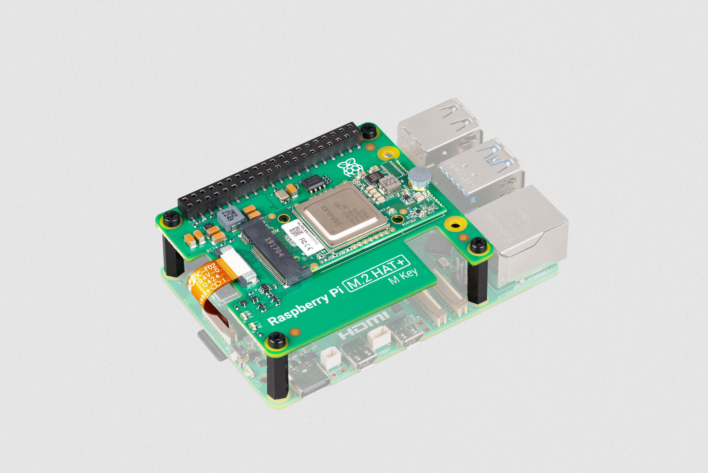
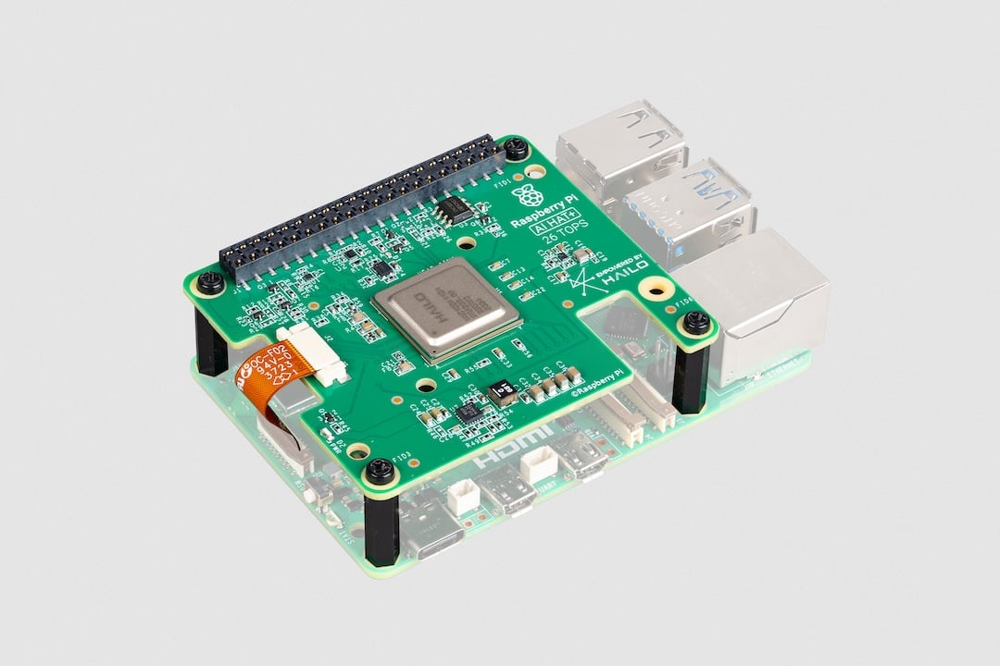

# How to Set Up Raspberry Pi 5 and Hailo

In this guide, you will learn how to set up the Raspberry Pi 5 with a Hailo-8/8L AI accelerator.


## What You'll Need
- Raspberry Pi 5 (8GB recommended)
- Raspberry Pi 5 AI KIT (option 1)
  - Raspberry Pi M.2 M-Key HAT
  - Hailo-8L M.2 M-Key module (Hailo-8 is also supported)
- Raspberry Pi 5 AI HAT (option 2)
  - 26TOPs and 13TOPs are supported
- Active Cooler for the Raspberry Pi 5
- Optional: Heat sink
- Optional: An official Raspberry Pi camera (e.g., Camera Module 3 or High-Quality Camera)
- Optional: USB camera

## Hardware
For this guide, we used the Raspberry Pi 5 model along with the official Active Cooler and a 27W USB-C Power Supply. We recommend using the official USB-C power supply to ensure the board can adequately power the M.2 HAT.


### Raspberry Pi M.2 M-Key HAT
The Raspberry Pi M.2 M-Key HAT can be used with the Hailo-8L M.2 key M or B+M. (Hailo-8 is also supported).
When installing the M.2 module, make sure to use the thermal pad to ensure proper heat dissipation between the M.2 module and the HAT.



### Raspberry Pi AI HAT
The Raspberry Pi AI HAT is a standalone board that includes the Hailo-8L AI accelerator. It is a plug-and-play solution that can be used with the Raspberry Pi 5.



make sure to have proper ventilation to avoid overheating. If required, add a heat sink to the Hailo-8 module.

## Software

### Install Raspberry Pi OS
Download and install the latest Raspberry Pi Imager for your OS (Windows, macOS, or Ubuntu) from [here](https://www.raspberrypi.com/software/).

Select the Raspberry Pi 5.


Select Raspberry Pi OS (64-bit).


### Update System
Boot up your Raspberry Pi 5 to a graphical environment and update your base software. To do this, open a terminal window and run:
```bash
sudo apt update
sudo apt full-upgrade
```
This will update your system to the latest Raspberry Pi kernel, which includes Hailo driver support.
If you get errors from the `apt full-upgrade` command try running this and retry.
```bash
sudo apt --fix-broken install
```

### Set PCIe to Gen3
To achieve optimal performance from the Hailo device, it is necessary to set PCIe to Gen3. While using Gen2 is an option, it will result in lower performance.

Open the Raspberry Pi configuration tool:
```bash
sudo raspi-config
```
Select option "6 Advanced Options", then select option "A8 PCIe Speed". Choose "Yes" to enable PCIe Gen 3 mode. Click "Finish" to exit.
##### Reboot your Raspberry Pi.
```bash
sudo reboot
```

### Install Hailo Software
Install all the necessary software to get the Raspberry Pi AI Kit working. To do this, run the following command from a terminal window:
```bash
sudo apt install hailo-all
```

##### Reboot your Raspberry Pi.
```bash
sudo reboot
```

### Verify Installation
Now you can check if the Hailo chip is recognized by the system:
```bash
hailortcli fw-control identify
```
If everything is OK, it should output something like this:
```bash
Executing on device: 0000:01:00.0
Identifying board
Control Protocol Version: 2
Firmware Version: 4.17.0 (release,app,extended context switch buffer)
Logger Version: 0
Board Name: Hailo-8
Device Architecture: HAILO8L
Serial Number: HLDDLBB234500128
Part Number: HM21LB1C2LAE
Product Name: HAILO-8L AI ACC M.2 B+M KEY MODULE EXT TMP
```
If you don't see this output, check the [PCIe troubleshooting](#pcie-troubleshooting) section.

#### Test TAPPAS Core installation by running the following commands:

Hailotools: (TAPPAS Gstreamer elements)
```bash
gst-inspect-1.0 hailotools
```
expected result:
```
Plugin Details:
  Name                     hailotools
  Description              hailo tools plugin
  Filename                 /lib/aarch64-linux-gnu/gstreamer-1.0/libgsthailotools.so
  Version                  3.28.2
  License                  unknown
  Source module            gst-hailo-tools
  Binary package           gst-hailo-tools
  Origin URL               https://hailo.ai/

  hailoaggregator: hailoaggregator - Cascading
  hailocounter: hailocounter - postprocessing element
  hailocropper: hailocropper
  hailoexportfile: hailoexportfile - export element
  hailoexportzmq: hailoexportzmq - export element
  hailofilter: hailofilter - postprocessing element
  hailogallery: Hailo gallery element
  hailograytonv12: hailograytonv12 - postprocessing element
  hailoimportzmq: hailoimportzmq - import element
  hailomuxer: Muxer pipeline merging
  hailonv12togray: hailonv12togray - postprocessing element
  hailonvalve: HailoNValve element
```

Hailonet: (HailoRT inference Gstreamer element)
```bash
gst-inspect-1.0 hailo
```
expected result:
```
Plugin Details:
  Name                     hailo
  Description              hailo gstreamer plugin
  Filename                 /lib/aarch64-linux-gnu/gstreamer-1.0/libgsthailo.so
  Version                  1.0
  License                  unknown
  Source module            hailo
  Binary package           GStreamer
  Origin URL               http://gstreamer.net/

  hailodevicestats: hailodevicestats element
  hailonet: hailonet element
  synchailonet: sync hailonet element

  3 features:
  +-- 3 elements
```
If `hailo` or `hailotools` are not found, try deleting the GStreamer registry:
```bash
rm ~/.cache/gstreamer-1.0/registry.aarch64.bin
```

### Clone the Repository
```bash
git clone https://github.com/hailo-ai/hailo-rpi5-examples.git
```
Navigate to the repository directory:
```bash
cd hailo-rpi5-examples
```

### Quick Installation
Run the following script to automate the installation process:
```bash
./install.sh
```

### To Run the Example:
When opening a new terminal session, ensure you have sourced the environment setup script:
```bash
source setup_env.sh
```
Run the detection example:
```bash
python basic_pipelines/detection.py
```
Run the pose estimation example:
```bash
python basic_pipelines/pose_estimation.py
```
Run the instance segmentation example:
```bash
python basic_pipelines/instance_segmentation.py
```
- To close the applications, press `Ctrl+C`.
#### Example For Using USB camera input:
   Detect the available camera using this script:
  ```bash
  python basic_pipelines/get_usb_camera.py ##There is no "get_usb_camera" file
  ```
  Run example using USB camera - Use the device found by the previous script:

  ```bash
  python basic_pipelines/detection.py --input /dev/video<X>
  ```
  For additional options, execute:
```bash
python basic_pipelines/detection.py --help
```
